# Screenshots

491b72c(theme/porcelain)のスクリーンショット(Androidエミュレータ API 34 / Pixel 6 で *ScreenshotTest が撮影)

## 動き(登場 → ボタンを押して離す → スイッチ → トグル → タブ)

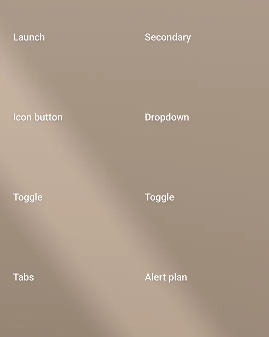

動かない場合は [GIF版](interactions.gif)

## catalog

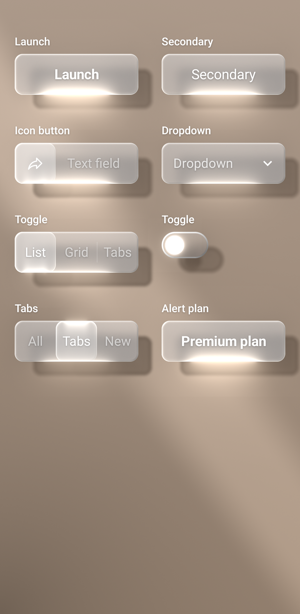

## catalog_pressed

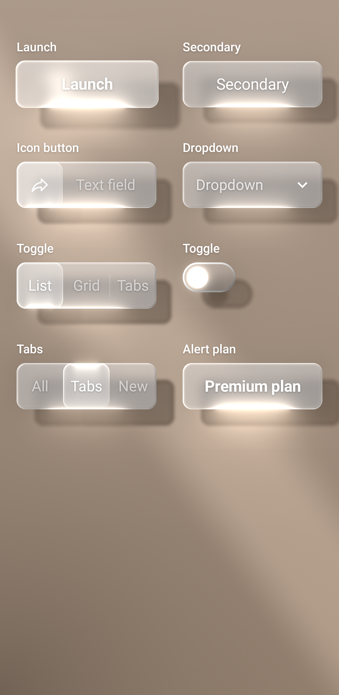

## detail

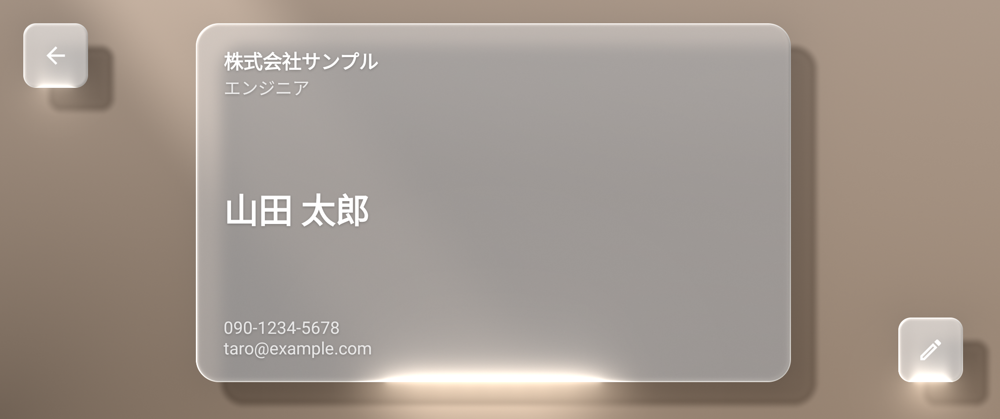

## edit

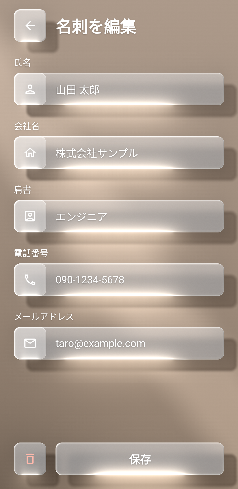

## edit_new_error

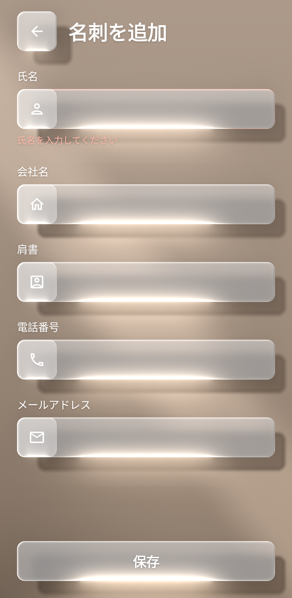

## list

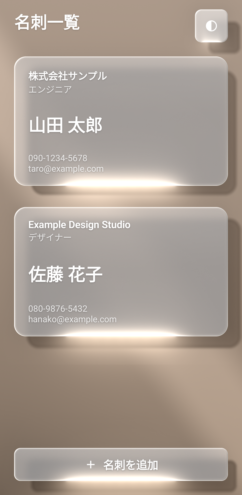

## list_empty

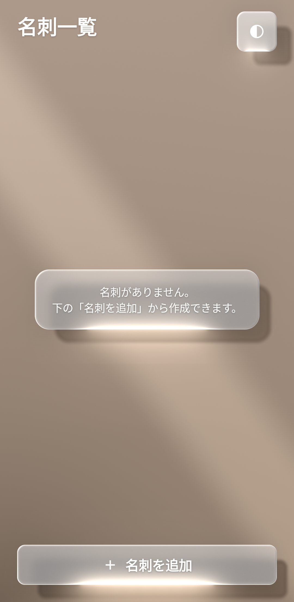

## porcelain_catalog

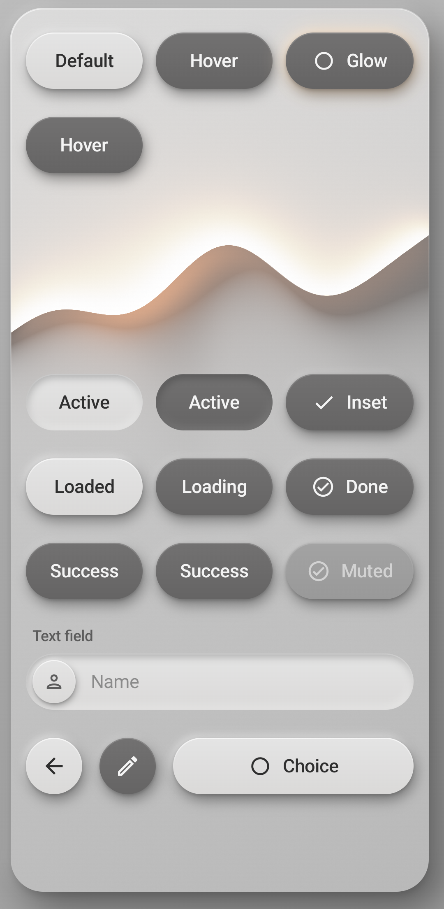

## porcelain_catalog_pressed

## porcelain_detail

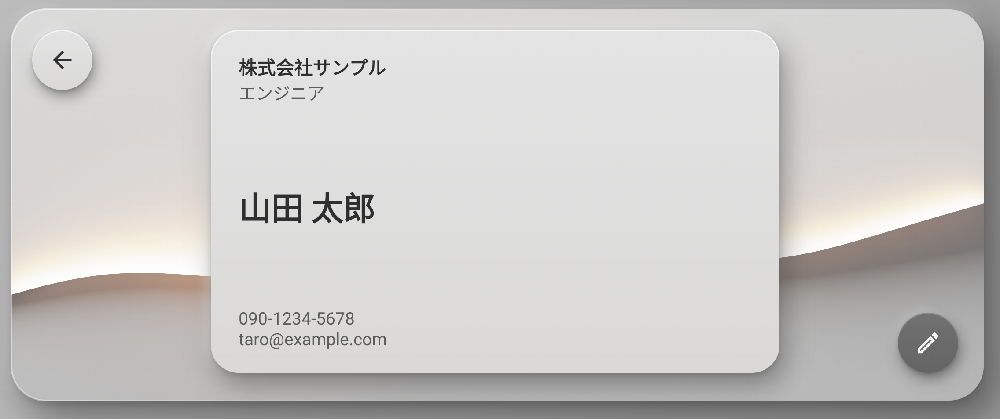

## porcelain_edit

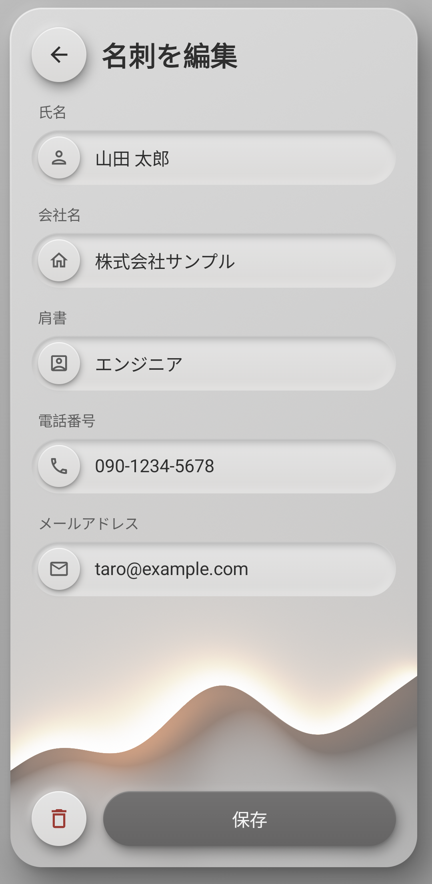

## porcelain_edit_new_error

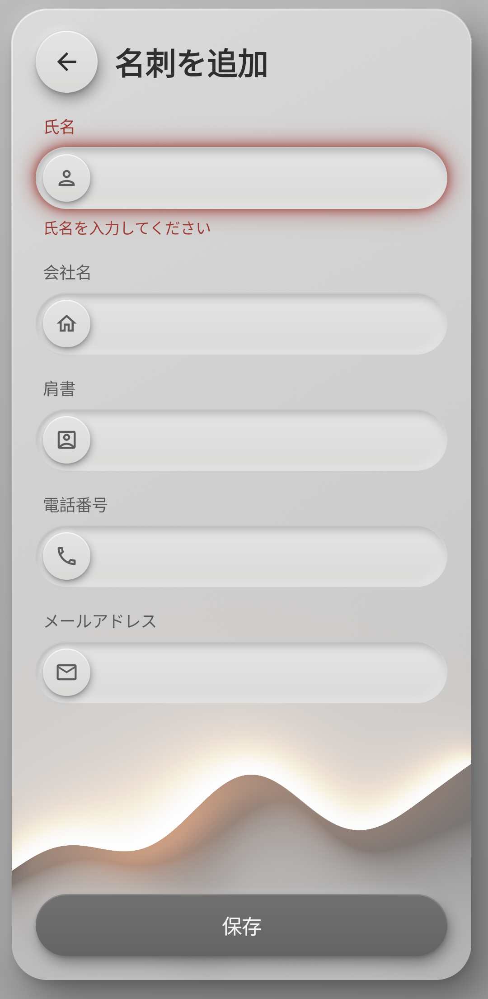

## porcelain_list

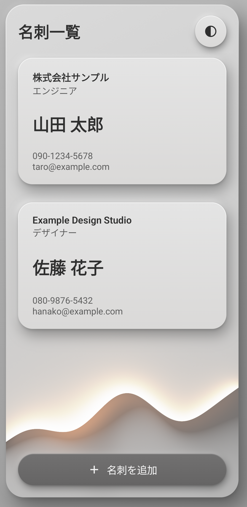

## porcelain_list_empty

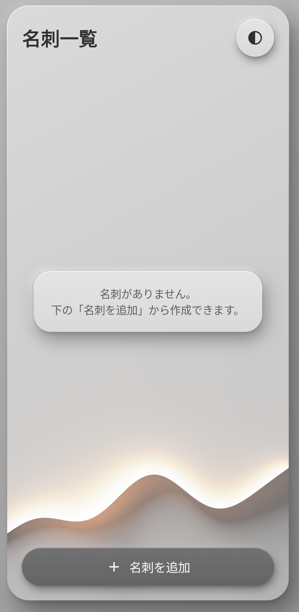

## porcelain_theme_dialog

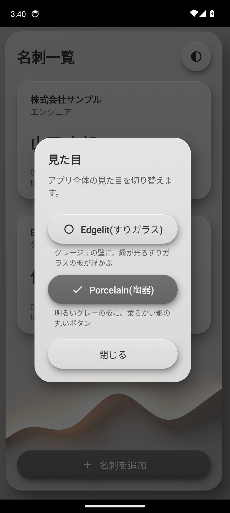

